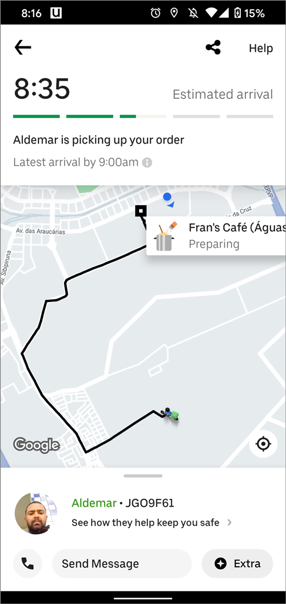

<h1> Trabalho realizado para a disciplina de Interação humano computador <h1>
  
Heurísticas

<h3>1 - Prevenção de erros: </h3>
Projetar interfaces que evitem erros é mais eficaz do que simplesmente fornecer mensagens de erro. Isso pode incluir confirmações, verificações e limites claros.

<h4>Exemplos:</h4>

 
Exemplo 1

  
 

  Um ótimo exemplo para essa heurística pode ser encontrado no próprio GitHub, que realiza diversas verificações antes de permitir a exclusão de um repositório. Essa prática ajuda a evitar que os usuários cometam erros irreversíveis, como excluir um repositório sem a devida intenção.
 

 

 

 
Exemplo 2

  
 

  No Gmail, temos outro bom exemplo, onde o site proporciona ao usuário a possibilidade de desfazer a exclusão de um e-mail.
 

 

 
 

<h3>2 - Visibilidade do status do sistema: </h3>
O sistema deve informar continuamente ao usuário sobre o que está acontecendo, fornecendo feedback adequado sobre as ações realizadas.

<h4>Exemplos:</h4>

 
Exemplo 1

  
 

  A seguir, o acompanhamento de Pedido no iFood. Os usuários podem rastrear em tempo real o status da entrega, desde a confirmação do pedido até a chegada do entregador, proporcionando uma visibilidade clara e informação em cada etapa não só da entrega, mas do pedido inteiro.
 

 

 

 
Exemplo 2

  
 

   No Uber, a possibilidade de acompanhar o motorista em tempo real oferece aos usuários uma visão clara do status da sua viagem. Desde a solicitação até a chegada do veículo.
 

 

 
 

 
<h3>3 - Consistência e padrões: </h3>
A interface deve seguir padrões consistentes para facilitar a familiaridade e a aprendizagem do usuário. Elementos similares devem se comportar da mesma forma em diferentes partes do sistema.

<h4>Exemplos:</h4>

 
Exemplo 1

  
 

  A barra de pesquisa do Google é um exemplo exemplar de consistência e usabilidade. No centro da página inicial, destaca-se uma barra de pesquisa branca, com uma fonte limpa e um ícone de lupa. Este design é amplamente reconhecido e utilizado em todos os serviços da empresa. Além disso, a adição do ícone do microfone ao lado da barra de pesquisa permite aos usuários realizar buscas por meio de comandos de voz, mantendo a mesma interface visualmente coesa e funcional.
 

 

 

 
Exemplo 2

  
 

   O botão de "Curtir" no YouTube é um exemplo notável de consistência e interatividade. Localizado abaixo de cada vídeo, esse botão é representado por um polegar para cima, oferecendo uma maneira padronizada e universalmente reconhecida para os usuários expressarem apreço pelo conteúdo.
 

 

 
 

<h3>4 - Reconhecimento ao invés de recordação: </h3>
Minimização da carga cognitiva do usuário, tornando as opções, ações e objetos visíveis e reconhecíveis, em vez de exigir que o usuário lembre informações específicas.

<h4>Exemplos:</h4>

 
Exemplo 

  
 

  O menu Iniciar no Windows utiliza um design visual, apresentando ícones familiares e rótulos para programas e aplicativos. Isso permite aos usuários reconhecerem facilmente o que desejam abrir, sem a necessidade de memorizar o nome de cada programa.
 

 

 
 

 
<h3>5 - Ajuda aos usuários a reconhecer, diagnosticar e recuperar erros: </h3>
O sistema deve ser projetado de forma a evitar erros sempre que possível. Isso pode ser feito através de mensagens de confirmação, restrições de entrada e designs que minimizem a possibilidade de erros.

<h4>Exemplos:</h4>

 
Exemplo 1

  
 

  No Facebook, ao esquecer a senha, os usuários podem facilmente recuperar o acesso à conta. A opção "Esqueceu a conta?" na tela de login direciona para uma página intuitiva de recuperação.
 

 

 

